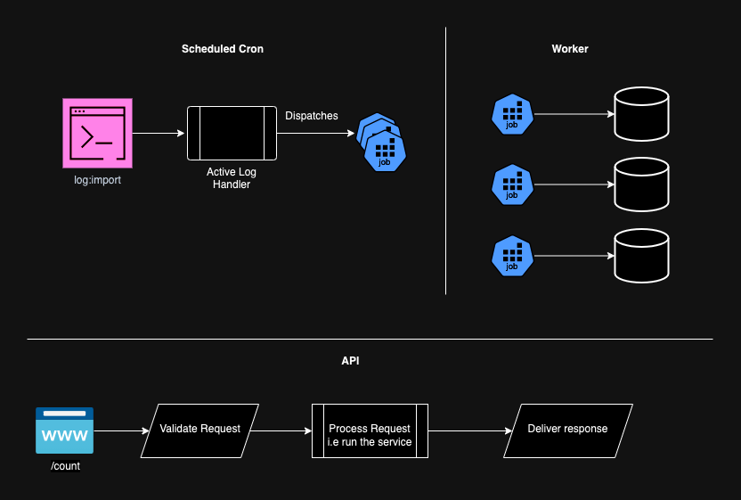

# LegalOne Coding challenge

A [Docker](https://www.docker.com/)-based installer and runtime for the [Symfony](https://symfony.com) web framework,
with [FrankenPHP](https://frankenphp.dev) and [Caddy](https://caddyserver.com/) inside!

## Getting Started

1. If not already done, [install Docker Compose](https://docs.docker.com/compose/install/) (v2.10+)
2. Run `docker compose build --no-cache` to build fresh images
3. Run `docker compose up --pull always -d --wait` to set up and start a fresh Symfony project
4. Open `https://localhost` in your favorite web browser and [accept the auto-generated TLS certificate](https://stackoverflow.com/a/15076602/1352334)
5. Run `docker compose down --remove-orphans` to stop the Docker containers.

## Running Application
* Please place/replace the log file in the public folder and adjust the ``REALTIME_LOG_FILE_PATH`` if needed.
* To Import log records, run ``docker compose exec php bin/console log:import``
* Run tests through ``docker compose exec php ./vendor/bin/phpunit``
* Run the analytics endpoint at ``https://localhost/count`` with the respective params attached with the OpenApi file attached with the task.

## Notes

* Dates on the analytics endpoint should be ISO 8061 format.
* The queuing system is set to `sync` there is no functional need to use a real one as it's only for concept proving.
* Nothing mentioned or written in this repository is perfect. you might find boilerplates, default configs or other non-production proof code.
* Here is a simple flow diagram to show the idea of the task.

